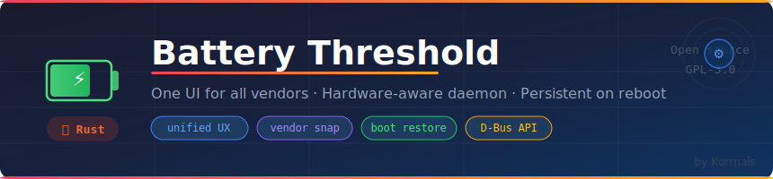

<div align="center">

# Battery Threshold



A GNOME Shell extension for managing laptop battery charge thresholds. Prolongs battery life by limiting maximum charge level.

[](https://www.gnu.org/licenses/gpl-3.0)
[](https://www.rust-lang.org/)
[](https://www.gnome.org/)
[](https://github.com/Korrnals/gnome-battery-threshold/actions)
[](https://github.com/Korrnals)

</div>

## ✨ Features

- 🔋 **Universal interface** — Same UX for all supported devices
- 🦀 **Rust backend** — Memory-safe, type-safe, performant
- 🔌 **Vendor abstraction** — Hardware differences hidden behind a unified API
- 🔐 **Least-privilege design** — Unprivileged UI + root daemon boundary
- 🎛️ **Live control** — Adjust thresholds from the system tray
- 💾 **Persistent settings** — Auto-applied on boot via systemd
- 📊 **D-Bus API** — Programmable interface for scripts and other tools

## 🖥️ Supported Hardware

| Vendor | Control Method | Notes |
|--------|---------------|-------|
| ASUS, Dell, Framework, Huawei, MSI | Standard sysfs | Native kernel support |
| ThinkPad / Lenovo | `tpacpi-bat`, `acpi_call`, `tp_smapi` | Multiple fallbacks |
| Xiaomi / Redmi | `acpi_call` (WMI) | Snaps to 40/50/60/70/80% |
| Samsung | `samsung-laptop` driver | Vendor-specific |
| Sony VAIO | `sony-laptop` driver | Vendor-specific |

> **Note:** Devices with fixed threshold levels (e.g. Xiaomi) present the same slider UI; values are transparently rounded to the nearest supported step at the daemon layer.

## 📋 Requirements

- GNOME Shell 45 or newer
- systemd-based Linux distribution
- D-Bus
- PolicyKit
- For Xiaomi/Lenovo via ACPI: `acpi_call` kernel module
- For build: Rust 1.75+, `cargo`, `make`, `glib-compile-schemas`

## 📦 Installation

> **Why two steps?** GNOME Shell can install the user-side extension in one
> click (e.g.o, Extension Manager), but it cannot install a system service.
> Battery Threshold needs a privileged daemon (`battery-thresholdd`) to talk
> to your hardware — so the **daemon** part has to be installed once at the
> system level, and only then the **extension** half plugs into it.
>
> Pick the variant that matches how you got here:

### ⚡ Quick install — Variant A: distro package (recommended)

Use this if you came here via [extensions.gnome.org](https://extensions.gnome.org/)
or you just want a clean `dnf` / `apt` install. No `make`, no Rust toolchain needed.

#### One-liner (auto-detects your OS)

```bash
curl -fsSL https://raw.githubusercontent.com/Korrnals/gnome-battery-threshold/main/scripts/install.sh | bash
```

The script picks the latest release, downloads the matching `.rpm` or `.deb`,
runs your package manager, and enables the GNOME extension. That's it.

> Want a specific version? `BT_TAG=v0.2.0 bash <(curl -fsSL ...install.sh)`

#### Manual (if you prefer)

Download the latest asset from the
[**Releases page**](https://github.com/Korrnals/gnome-battery-threshold/releases/latest)
and install it with your package manager:

<details>
<summary><b>Fedora / RHEL / openSUSE (RPM)</b></summary>

```bash
sudo dnf install ./gnome-battery-threshold-*.rpm
```
</details>

<details>
<summary><b>Ubuntu / Debian / Mint (DEB)</b></summary>

```bash
sudo apt install ./gnome-battery-threshold_*.deb
```
</details>

The package installs **everything** in one shot: daemon, systemd unit, D-Bus
policy, PolicyKit action, GSettings schema **and** the extension files under
`/usr/share/gnome-shell/extensions/`.

Then enable the extension once (GNOME requires explicit user consent for new
extensions — this can't be automated from a system package):

```bash
gnome-extensions enable battery-threshold@korrnals.github.io
```

Or flip the toggle in **Extension Manager** / on extensions.gnome.org.

**(Xiaomi / some ThinkPads only)** install the `acpi_call` kernel module —
see [docs/INSTALL.md → Step 2](docs/INSTALL.md#step-2--install-kernel-module-xiaomi--thinkpad).
Standard sysfs-based laptops (ASUS, Dell, Framework, MSI, modern ThinkPads)
skip this step.

### 🔧 Quick install — Variant B: from source

Use this if your distro isn't covered above, you want the bleeding edge from
`main`, or you're a developer. Requires **`make`**, **Rust 1.75+**, **`cargo`**
and **`glib-compile-schemas`** on the build machine.

```bash
git clone https://github.com/Korrnals/gnome-battery-threshold.git
cd gnome-battery-threshold

make doctor            # check what's detected on your system (no root)
make deps              # show distro-specific build deps to install
make build             # compile daemon + bundle extension (no root)
sudo make install      # install daemon + extension (one command)

gnome-extensions enable battery-threshold@korrnals.github.io
```

**Fedora Silverblue / Kinoite:** the Makefile auto-detects an immutable `/usr`
and installs to `/usr/local` — no manual flags needed.
See [immutable systems section](docs/INSTALL.md#immutable-systems-fedora-silverblue--kinoite).

> **Full installation guide:** [docs/INSTALL.md](docs/INSTALL.md) — covers
> per-distro dependencies, `acpi_call` setup, verification, and troubleshooting.

## 🚀 Usage

After enabling:

1. Click the battery icon in the top panel
2. Toggle **Enable Thresholds**
3. Adjust the **Start** and **End** sliders
4. Click **Apply**

The settings persist across reboots automatically.

## 📝 Release Notes (extensions.gnome.org)

Battery Threshold provides a single, consistent control surface for battery
charge limits across very different laptop vendors.

What makes it different from similar extensions:

- One unified GNOME UI across sysfs and ACPI-based hardware
- Server-side snapping for discrete firmware limits (for example Xiaomi)
- Persistent state with automatic restore on boot via systemd
- Clear privilege split: unprivileged extension UI + dedicated root daemon
- Public D-Bus interface for scripting and external automation

Recent updates:

- Four-state panel icon set for clearer status at a glance
- Cleanup of legacy/debug-only code paths in the extension
- Improved docs for immutable Fedora systems and vendor setup
- Distro packages (RPM, DEB) published with every tagged release

## 🏗️ Architecture

```
┌────────────────────────────────────┐
│  GNOME Shell Extension (GJS)       │
│  · Panel indicator                 │
│  · Preferences (Adw)               │
│  · D-Bus client                    │
└────────────────┬───────────────────┘
                 │ system D-Bus
                 ▼
┌────────────────────────────────────┐
│  battery-thresholdd (Rust, async)  │
│  · zbus D-Bus service              │
│  · Vendor abstraction layer        │
│  · PolicyKit policy (hook pending) │
└────────────────────────────────────┘
                 │
                 ▼
┌────────────────────────────────────┐
│  Hardware backends                 │
│  · sysfs (charge_control_*)        │
│  · acpi_call (Xiaomi, Lenovo)      │
│  · tpacpi-bat (ThinkPad)           │
└────────────────────────────────────┘
```

See [docs/ARCHITECTURE.md](docs/ARCHITECTURE.md) for details.

## 🛠️ Development

```bash
# Build everything
make build

# Run daemon in dev mode (no install needed)
make daemon-dev

# Run tests
make test

# Lint
make lint

# Create distribution archive
make dist
```

See [docs/DEVELOPMENT.md](docs/DEVELOPMENT.md) for the full development guide.

## 🤝 Contributing

Contributions are welcome! Please read [CONTRIBUTING.md](CONTRIBUTING.md) before submitting a pull request.

To add support for a new vendor, see [docs/ADDING_VENDORS.md](docs/ADDING_VENDORS.md).

## 📄 License

GPL-3.0-or-later. See [LICENSE](LICENSE) for details.

## 👤 Author

**Korrnals**

- GitHub: [@Korrnals](https://github.com/Korrnals)
- Project: [gnome-battery-threshold](https://github.com/Korrnals/gnome-battery-threshold)

If this project helps you — a ⭐ on GitHub means a lot!

## 🙏 Credits

- ACPI research for Xiaomi: [ArchWiki — Xiaomi RedmiBook Pro 16 2025](https://wiki.archlinux.org/title/Xiaomi_RedmiBook_Pro_16_2025)
- GNOME Shell extension ecosystem
- The `zbus` and `tokio` Rust communities
